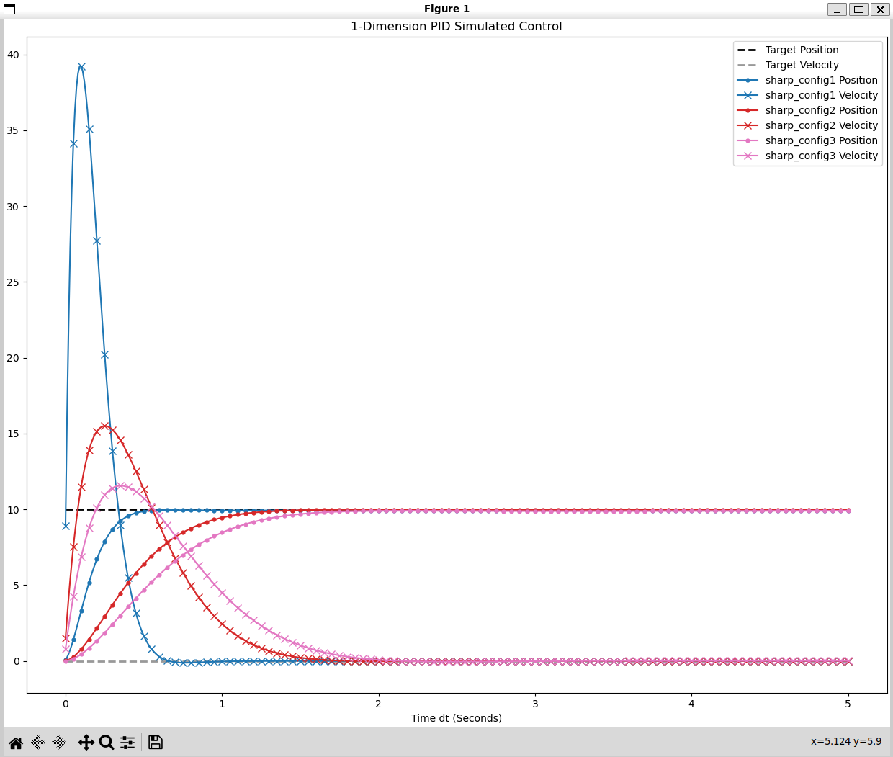
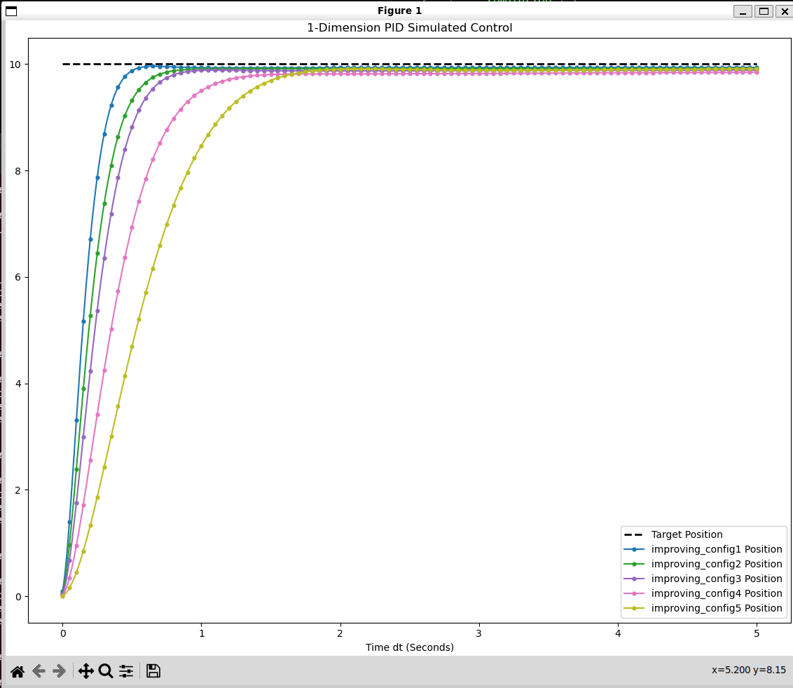
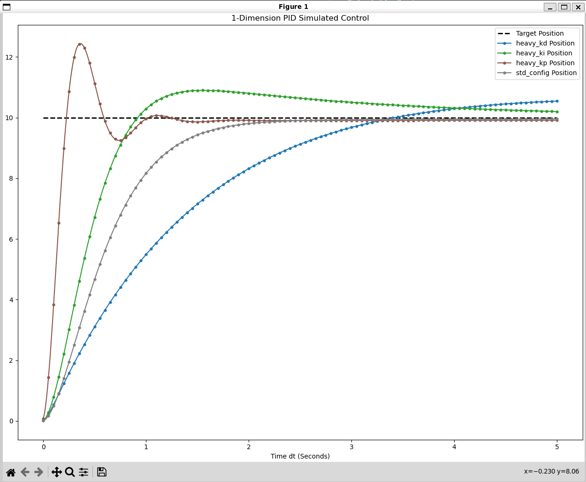
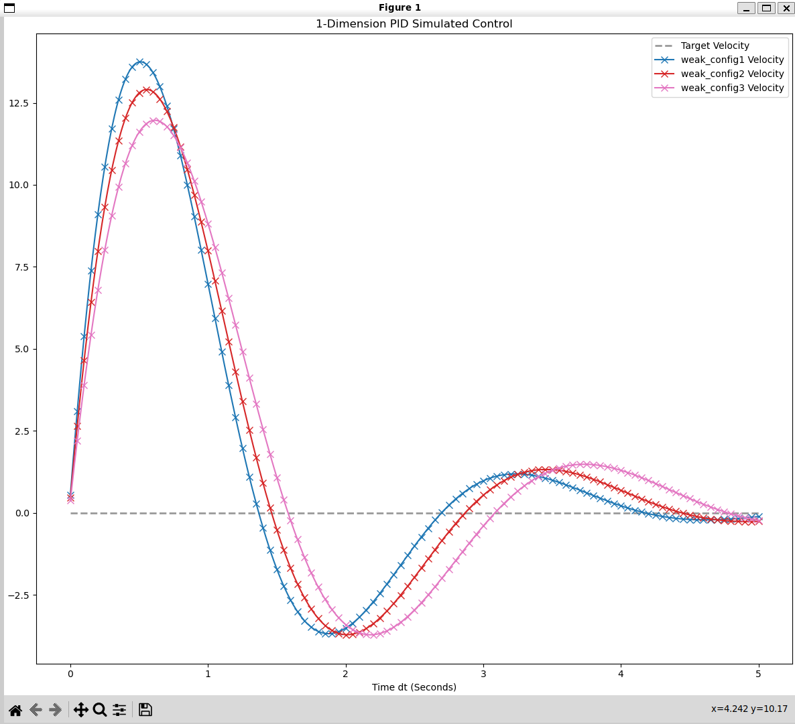

# PID Simulation — CLI Control with Robust Architecture

[](#getting-started)
[](#getting-started)
[](#getting-started)
[](LICENSE)

A from-scratch C++20 PID controller simulation with a Python toolkit for running, comparing, and visualizing tunings. Give it a target position, gains (`kp`, `ki`, `kd`), and a few physical parameters — it simulates the response and writes the result to CSV.

## About

This is my first C++ project, built without AI assistance to learn the fundamentals of C++ and PID control. Started as a personal learning exercise; now doubles as a portfolio piece, written to be used or expanded upon by anyone.

Core question: given a point mass at rest, how does a PID controller drive it to a target position, and how do `kp`/`ki`/`kd` changes affect that response? C++ handles the physics and control loop; Python handles batch runs and plotting, so tunings can be compared side-by-side without touching C++.

## Demo / Example Output

<table>
  <tr>
    <td align="center">
      <br>
      <sup>Position and velocity data displayed.</sup>
    </td>
    <td align="center">
      <br>
      <sup>Gradually improving PID tunings.</sup>
    </td>
  </tr>
  <tr>
    <td align="center">
      <br>
      <sup>Poor and improved tuned PIDs.</sup>
    </td>
    <td align="center">
      <br>
      <sup>Comparing slight PID variances.</sup>
    </td>
  </tr>
</table>

## Getting Started

### Prerequisites

- CMake ≥ 3.14
- A C++20 compiler (e.g. GCC 13+ or Clang 16+ — the project uses `std::format`)
- Python 3.12+
- `pandas` and `matplotlib`

```bash
python -m venv .venv
source .venv/bin/activate
pip install pandas matplotlib
```

### Build

```bash
cmake -B build -S .
cmake --build build
```

You won't usually invoke it directly — `run.py` auto-builds it if missing, but manual option available.

### First run

```bash
python src/python/run.py -c std_config.json
python src/python/viz.py -s std_config.csv --showpos
```

The first runs `config/std_config.json` and writes `data/std_config.csv`; the second plots position from it. Visualization can be re-run to display other data like velocity and applied force, simulation does not need to be re-run.

## Configuration Reference

Each config is JSON with four optional top-level sections; omitted fields fall back to the defaults below.

| Section | Field | Type | Default | Description |
|---|---|---|---|---|
| `simulation` | `dt` | float | `0.01` | Integration timestep, in seconds |
| `simulation` | `gravity_accel` | float | `9.81` | Gravitational acceleration applied to the mass, in m/s² |
| `simulation` | `max_seconds` | float | `0.8` | Wall-clock time budget, in seconds — the run is aborted if it takes longer than this to *compute*, regardless of simulated duration |
| `simulation` | `simulated_duration` | float | `5.0` | Length of simulated time to run, in seconds |
| `physical_props` | `mass_kg` | float | `5.0` | Mass of the simulated point object, in kg |
| `physical_props` | `start_pos` | float | `0.0` | Starting position, in meters |
| `physical_props` | `target_pos` | float | `10.0` | Target position (setpoint) the PID controller drives toward, in meters |
| `pid_gains` | `kp` | float | `0.0` | Proportional gain |
| `pid_gains` | `ki` | float | `0.0` | Integral gain |
| `pid_gains` | `kd` | float | `0.0` | Derivative gain |
| `data_handling` | `record_sim_duration` | bool | `true` | Whether to record the wall-clock run time in the CSV header |

`config/min_config.json` — the minimum viable config, relying on defaults for everything but gains:

```json
{
    "simulation": {},
    "physical_props": {},
    "pid_gains": {
        "kp": 50.0,
        "ki": 7.0,
        "kd": 30.0
    },
    "data_handling": {}
}
```

`config/std_config.json` is a fully-specified example:

```json
{
    "simulation": {
        "gravity_accel": 9.81,
        "dt": 0.01,
        "max_seconds": 0.8,
        "simulated_duration": 5.0
    },
    "physical_props": {
        "mass_kg": 5,
        "start_pos": 0.0,
        "target_pos": 10.0
    },
    "pid_gains": {
        "kp": 50.0,
        "ki": 7.0,
        "kd": 30.0
    },
    "data_handling": {
        "record_sim_duration": true
    }
}
```

### Config subfolders

| Folder | Demonstrates |
|---|---|
| `compare_pids/` | Isolates a single gain at a time (`heavy_kp.json`, `heavy_ki.json`, `heavy_kd.json`) to show its individual effect on the response |
| `improving_pids/` | A progressive sequence of five configs showing iterative tuning improvements |
| `sharp_pids/` | High-gain, aggressive tunings that settle quickly but tend toward overshoot/oscillation |
| `weak_pids/` | Low-gain tunings that respond slowly and sluggishly |

## CLI Reference

### `run.py` — run simulations

```
python src/python/run.py [OPTIONS]
```

| Flag | Alias | Type | Default | Description |
|---|---|---|---|---|
| `--config` | `-c` | str (one or more) | *(required)* | Config file name(s) or a single folder name under `config/` (e.g. `weak_pids/`) |
| `--exempt` | `-e` | flag | `False` | Bypass the 50-simulation safety cap |
| `--verbose` | `-v` | flag | `False` | Print debug data from the C++ simulation |
| `--folder` | `-fo` | str | `''` | Write output CSVs to `data/<name>/` instead of directly into `data/` |

```bash
# Run a single config with debug output
python src/python/run.py -c std_config.json -v

# Run every config in weak_pids/, writing CSVs to data/weak/
python src/python/run.py -c weak_pids/ --folder weak

# Run more than 50 simulations at once
python src/python/run.py -c <folder_name>/ --exempt
```

### `viz.py` — visualize results

```
python src/python/viz.py [OPTIONS]
```

| Flag | Alias | Type | Default | Description |
|---|---|---|---|---|
| `--specify` | `-s` | str (one or more) | all `.csv` in `data/` | CSV file name(s), or a single folder name — typically one created by `run.py`'s `-fo` (e.g. `-s weak/` after `run.py -fo weak`) |
| `--showpos` | `-p` | flag | `False` | Plot position |
| `--showvel` | `-ve` | flag | `False` | Plot velocity |
| `--showappliedforce` | `-af` | flag | `False` | Plot applied force |
| `--nolegend` | `-nl` | flag | `False` | Hide the legend |
| `--exempt` | `-e` | flag | `False` | Bypass the 50-simulation combined-graph cap |
| `--animated <ms>` | — | int | `0` | Accepted but not yet wired to actual animation rendering (see [Known Issues](#known-issues--roadmap)) |
| `--verbose` | `-v` | flag | `False` | Print debug info while parsing CSVs |

```bash
# Visualize a single result, showing all three traces
python src/python/viz.py -s std_config.csv -p -ve -af

# Visualize an entire folder of results produced by `run.py -fo weak`
python src/python/viz.py -s weak/ -p
```

## Example Workflow

1. **Pick or write a config.** Start from `config/min_config.json` or `config/std_config.json` and adjust `kp`/`ki`/`kd`, `target_pos`, etc.
2. **Run it:**
   ```bash
   python src/python/run.py -c my_config.json
   ```
3. **Visualize it:**
   ```bash
   python src/python/viz.py -s my_config.csv -p -ve -af
   ```
4. **Compare tunings.** Group a batch into a named folder, then visualize it as one combined graph:
   ```bash
   python src/python/run.py -c weak_pids/ sharp_pids/ -fo compare
   python src/python/viz.py -s compare/ -p
   ``

## Features

- **Config-driven** — physical properties, PID gains, and timing all live in JSON, with sensible defaults for anything omitted.
- **Batch runs** — point `run.py` at one config, several, or a whole folder.
- **CSV telemetry** — every run logs time, force, position, and velocity per timestep, with gains and duration recorded in the header.
- **Selective plotting** — overlay position, velocity, and/or applied force for one or many runs on a single combined graph.
- **Organized comparisons** — `run.py -fo <name>` groups a batch of outputs into `data/<name>/`; `viz.py -s <name>/` then visualizes that whole folder at once.
- **Built-in tuning examples** — config folders demonstrating weak, sharp, and improving PID tunings, plus single-gain comparisons (see [Configuration Reference](#configuration-reference)).
- **Safety caps** — both scripts cap batch size at 50 by default; `--exempt` overrides it.
- **Dual kill switches** — every run stops at its configured simulated duration or a wall-clock time budget, whichever comes first.

## Architecture

The project is split into two layers that don't know about each other's internals: a fast C++ simulation core, and a Python layer that orchestrates batches of runs and visualizes them. JSON is the contract going in; CSV is the contract coming out.

### Layers

- **C++ core** (`main.cpp`, `phys_sim.cpp`, `PID.cpp`, `file_conv.cpp`) — reads one JSON config, runs the physics + PID loop as fast as possible, writes one CSV. No concept of batching, comparisons, or plotting.
- **JSON config** — the human-editable contract between you and the C++ core (see [Configuration Reference](#configuration-reference)).
- **Python layer** (`run.py`, `viz.py`) — owns everything about *many* simulations: discovering configs, running them in batch, organizing outputs, and plotting. None of this logic touches the C++ side.

### Data flow

```
config/*.json → run.py → build/new_test <config> <csv> <verbose> → data/*.csv → viz.py → matplotlib figure
```

`run.py` resolves config names/folders to paths, builds the executable if needed, and shells out to it once per config. `viz.py` independently resolves CSV names/folders to paths and plots them — it never touches the simulation, so you can replot existing data without rerunning anything.

### The run.py / viz.py split — and why it matters

`run.py`'s `-fo/--folder <name>` groups a batch of outputs into `data/<name>/`. `viz.py`'s `-s/--specify` then accepts either individual CSV filenames or that same folder name to visualize the whole batch at once. The simulation core and config files never need to know how their outputs get organized or compared — that's a Python-layer concern only. Adding a new way to group or compare runs touches `run.py`/`viz.py` and nothing in C++.

### Physics & control loop

A single point mass moves under gravity and a PID-controlled applied force:

```
a = (F_applied - F_gravity) / mass        # F_gravity = mass * gravity_accel
velocity += a * dt
position += velocity * dt
```

Each tick, `PIDCalculator` (`PID.hpp`/`PID.cpp`) computes:

```
error      = target_pos - position
sumError  += error * dt
force      = kp * error + ki * sumError - kd * velocity
```

The derivative term brakes against velocity directly; there's no anti-windup on `sumError`.

`main.cpp` wires one run together: load config → construct `PIDCalculator` + `PhysicsSim` → loop (compute force → integrate → record) until either `simulated_duration` or `max_seconds` (wall-clock, checked every ~200 ticks) is hit → write the CSV.

### Output format

```
# kp: 50 ki: 7 kd: 30 Duration: 12.3456 ms
Time,Force,Position,Velocity
0,0,0,0
0.01,245.5,0.0123,1.227
...
```

Line 1 is a comment with the gains used and (if `record_sim_duration` is set) the wall-clock duration in ms; line 2 is the column header; every line after is one timestep.`

## Known Issues / Roadmap

- **No integral anti-windup.** `sumError` accumulates unclamped, so saturated or long-running configs can wind up.
- **`--animated` is a no-op.** `viz.py` accepts `--animated <ms>`, but `setAnimationTime()` is never called and no animation is actually rendered yet.

## License

[MIT](LICENSE)
